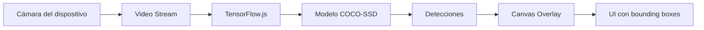

# README - On-Device Object Detection

Aplicación móvil de detección de objetos en tiempo real que funciona completamente offline utilizando inteligencia artificial directamente en el dispositivo.

## 🚀 Tecnologías

### Framework y UI
- **Vue 3** - Framework principal de la aplicación 
- **Ionic Vue** - Componentes UI para experiencia móvil nativa 
- **Capacitor** - Puente entre web y nativo (Android/iOS) 

### Inteligencia Artificial
- **TensorFlow.js** - Motor de inferencia en el dispositivo
- **COCO-SSD** - Modelo pre-entrenado para detección de 80+ clases de objetos

### Herramientas de Desarrollo
- **Vite** - Build tool y servidor de desarrollo 

## 🏗️ Arquitectura

### Flujo de Detección


### Componente Principal
La aplicación se centra en `CameraView.vue` que gestiona:
- Captura de video desde la cámara trasera 
- Detección de objetos usando el modelo COCO-SSD 
- Renderizado de resultados en canvas overlay 
## ⚙️ Funcionamiento

### 1. Inicialización
- Importación de TensorFlow.js para registrar backends 
- Carga del modelo COCO-SSD (8-10MB) 
- Estado de carga "Cargando IA..." durante inicialización 

### 2. Detección en Tiempo Real
- Bucle de detección usando `requestAnimationFrame` 
- Throttling a 5-10 FPS para mantener rendimiento 
- Procesamiento de frames del video directamente en el modelo

### 3. Visualización
- Canvas superpuesto sobre el video para mostrar resultados 
- Bounding boxes con colores distintos por clase 
- Etiquetas con porcentaje de confianza 

## 📱 Instalación y Ejecución

```bash
# Instalar dependencias
npm install

# Desarrollo
npm run dev

# Build para producción
npm run build

# Sincronizar con Capacitor (Android/iOS)
npm run cap:sync
```

## 📁 Estructura del Proyecto

```
src/
├── main.js                 # Punto de entrada Vue
├── components/
│   └── CameraView.vue      # Componente principal de cámara y detección
capacitor.config.json       # Configuración Capacitor
package.json               # Dependencias y scripts
SPEC.md                    # Especificaciones técnicas
```

## 🔧 Características Clave

- **Offline First**: Funciona sin conexión a internet después de la carga inicial 
- **Detección en Tiempo Real**: 5-10 FPS para balance rendimiento y fluidez 
- **80+ Clases de Objetos**: Personas, coches, bicicletas, etc. 
- **Optimizado para Móvil**: Modelo cuantizado de 8-10MB 

## Notes
El README está basado en la documentación del proyecto incluyendo especificaciones técnicas en SPEC.md, configuración en package.json, y la implementación del componente principal CameraView.vue. La aplicación utiliza una arquitectura híbrida que combina el rendimiento del acceso nativo al hardware con la agilidad del desarrollo web.
