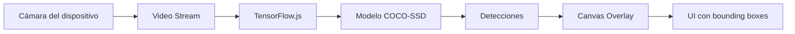

# README - On-Device Object Detection

Aplicación móvil de detección de objetos en tiempo real que funciona completamente offline utilizando inteligencia artificial directamente en el dispositivo.

## 🚀 Tecnologías

### Framework y UI
- **Vue 3** - Framework principal de la aplicación [1](#0-0) 
- **Ionic Vue** - Componentes UI para experiencia móvil nativa [2](#0-1) 
- **Capacitor** - Puente entre web y nativo (Android/iOS) [3](#0-2) 

### Inteligencia Artificial
- **TensorFlow.js** - Motor de inferencia en el dispositivo [4](#0-3) 
- **COCO-SSD** - Modelo pre-entrenado para detección de 80+ clases de objetos [5](#0-4) 

### Herramientas de Desarrollo
- **Vite** - Build tool y servidor de desarrollo [6](#0-5) 

## 🏗️ Arquitectura

### Flujo de Detección


### Componente Principal
La aplicación se centra en `CameraView.vue` que gestiona:
- Captura de video desde la cámara trasera [7](#0-6) 
- Detección de objetos usando el modelo COCO-SSD [8](#0-7) 
- Renderizado de resultados en canvas overlay [9](#0-8) 

## ⚙️ Funcionamiento

### 1. Inicialización
- Importación de TensorFlow.js para registrar backends [10](#0-9) 
- Carga del modelo COCO-SSD (8-10MB) [11](#0-10) 
- Estado de carga "Cargando IA..." durante inicialización [12](#0-11) 

### 2. Detección en Tiempo Real
- Bucle de detección usando `requestAnimationFrame` [13](#0-12) 
- Throttling a 5-10 FPS para mantener rendimiento [14](#0-13) 
- Procesamiento de frames del video directamente en el modelo [15](#0-14) 

### 3. Visualización
- Canvas superpuesto sobre el video para mostrar resultados [16](#0-15) 
- Bounding boxes con colores distintos por clase [17](#0-16) 
- Etiquetas con porcentaje de confianza [18](#0-17) 

## 📱 Instalación y Ejecución

```bash
# Instalar dependencias
npm install

# Desarrollo
npm run dev

# Build para producción
npm run build

# Sincronizar con Capacitor (Android/iOS)
npm run cap:sync
```

## 📁 Estructura del Proyecto

```
src/
├── main.js                 # Punto de entrada Vue
├── components/
│   └── CameraView.vue      # Componente principal de cámara y detección
capacitor.config.json       # Configuración Capacitor
package.json               # Dependencias y scripts
SPEC.md                    # Especificaciones técnicas
```

## 🔧 Características Clave

- **Offline First**: Funciona sin conexión a internet después de la carga inicial [19](#0-18) 
- **Detección en Tiempo Real**: 5-10 FPS para balance rendimiento y fluidez [20](#0-19) 
- **80+ Clases de Objetos**: Personas, coches, bicicletas, etc. [21](#0-20) 
- **Optimizado para Móvil**: Modelo cuantizado de 8-10MB [22](#0-21) 

## Notes
El README está basado en la documentación del proyecto incluyendo especificaciones técnicas en SPEC.md, configuración en package.json, y la implementación del componente principal CameraView.vue. La aplicación utiliza una arquitectura híbrida que combina el rendimiento del acceso nativo al hardware con la agilidad del desarrollo web.
